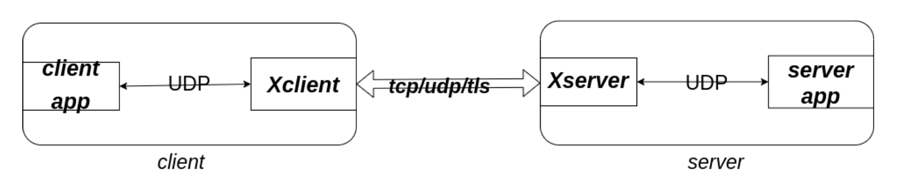
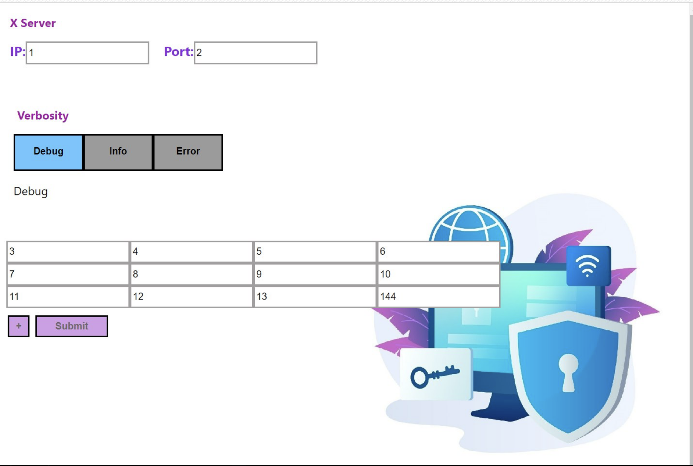

# Cloak, but not really

#### Computer networks project - Winter of 2023
#### Saee Saadat, Neda Taghizadeh

 

## Summary
The project consists of 2 main files, XClient and XServer. Here's a diagram of how it works:


---

XServer will be running on a different machine, listening on a TCP port waiting for the 
XClient to start a connection. each TCP connection is only used for a single client-server pair.

XClient on the other hand, will get a list of UDP tunnel information in the format:
```
XClientListeningIP:XClientListeningPort:ServerAppIP:ServerAppPort 
```
With this architecture, clientApps can be added dynamically and use the XClient, after XClient has been initiated, 
but they can only connect to the predefined servers (when initiating XClient)

When a new clientApp connects to XClient (by initiating a UDP connection), XClient will initiate a new TCPConnection to 
XServer.

for example, if 2 different clients want to connect to a single server, they will both use the same UDP port
from XClient, but XClient will use 2 different TCP connections to send their packets to XServer.

Sufficient comments have been provided in each file explaining what each function does or how it does it.


# Multi Processing
both XServer and XClient, use multiple processes to handle the requests.
for each tunnel (ClientApp - XClient - XServer - Server), there are 2 processes on botch XClient and Xserver, one responsible for 
the UDP connection and one for the TCP connection. Said processes use ``multiprocessing.Queue`` queues to communicate with one another.
each process, uses ``select`` to handle the sockets asynchronously. Please see comments on each file/function for more 
in-depth explanations.


## The general flow:
### XClient
ClientApp sends a UDP packet to one of XClient's listening ports.  
Then XClient will check if there's an already established TCP connection to XServer for that ClientApp (Using its address)  
If not, a new TCP connection from XClient to XServer will be created. and the first message would be the IP and Port number of ServerApp.  
Along with the TCP connection, 2 queues (request_queue and response_queue) will be created which can be accessed by the parent process using the address (just like the tcp socket)  
```
tcp_socket = tcp_conn_list[addr]
request_queue, response_queue = queues_list[addr]
```
addr = (ClientApp's ip, ClientApp's port number)

After these initiations, every request coming from that ClientApp will pass through this established TCP socket.

_Extra Credit: tcp sockets between XClient and XServer use SSL for encryption using cert.pem and key.pem and the built-in ssl module of python._

### XServer
XServer is listening on a specified port, waiting for secure TCP connections.
Once a new connection establishes, two new subprocess will begin. one for handling the TCP connection and one for the UDP connection (to ServerApp)  
As mentioned before, the first packet must specify the ip and port of remote server.
After that, all received packets will be put in the request_queue (just like XClient), and then they'll be read by the other subprocess (which handles the UDP connection)
to send the packet to server. When the server responds, the UDP subprocess will receive that response packet and put it in the response queue which will be picked by the TCP subprocess and sent back to XClient

### XClient (again)
After XServer sends the server's response through the TCP socket, XClient's TCP subprocess will receive the packet, put it in 
the appropriate response_queue (remember for each clientApp there are different queues) and the UDP subprocess will then read it from that queue and send it back to the client

---

# How to test:

to mimic a clientApp, we can just use the ``nc`` command as such:
```nc XClientIp XClientPort``` and then just send whatever packet we like in string format 
(could be HTML or whatever we want!) and everything will be logged so we  can just check either the stdout or the
latest log files in the ``logs/`` directory. 

Also to mimic a ServerApp, all we need to do is to use ``nc`` again like ``nc -u -l ServerAppIP ServerAppPort``
and we should see the packets that we were sending from clientApp, shown in there.

Here's a picture of our test:

- Top left corner: XClient
- Top right corner: XServer
- Bottom left corner: ClientApp
- Bottom right corner: ServerApp

There's a slight problem with the server side, which is that it can only listen to a single UDP connection, and since our 
implementation establishes a new socket for each client, ``nc -u -l ServerAppIP ServerAppPort`` will not work properly to respond multiple clientApps.
To fix that, we can use  ``nc -kluvw 10 ServerAppIp ServerAppPort`` which allows multiple connections and has a 10-second timeout for each connection.
so you can send a request with one client, respond within 10 seconds (or wait it out), and then send another request with another ClientApp, and you'll see that it works perfectly.

# UI / API
For some extra points, We have implemented a User interface (using React.js) and a RESTAPI endpoint (using FastAPI) to start the client.
something similar could also be used to start the server, but unfortunately we couldn't make it in time.

you can start the client app by calling POST {host}:{ip}/start_client/ and sending the appropriate configuration in a json body like:
```JSON
{
    "xserver": {
        "ip": "127.0.0.1",
        "port": 1771
    },
    "verbosity": "info",
    "udp_tunnels": [
        {
            "listening_ip": "127.0.0.1",
            "listening_port": 1881,
            "remote_ip": "127.0.0.1",
            "remote_port": 1771
        },
        {
            "listening_ip": "127.0.0.1",
            "listening_port": 1882,
            "remote_ip": "127.0.0.1",
            "remote_port": 1772
        }
    ]
}
```

And our UI looks something like this:

Visit [UI Repo](https://github.com/nedataghizadeh79/front-of-the-network-lesson-project) to view the Front-end project.
